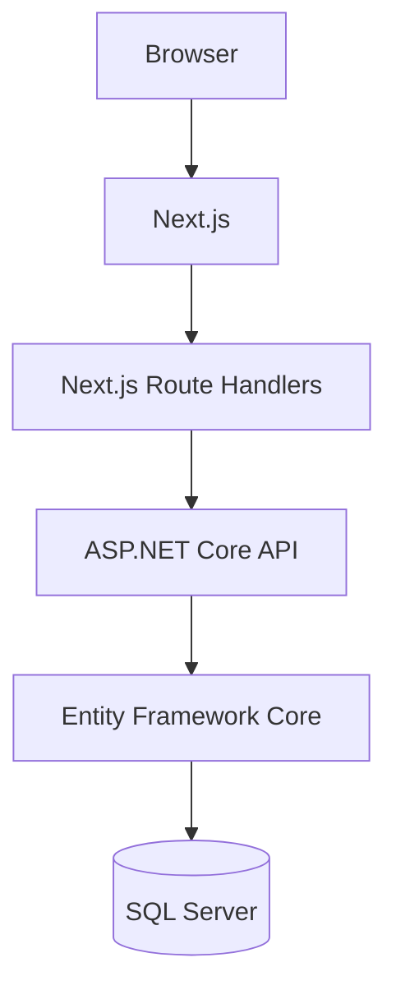

# IncidentFlow

Enterprise-style incident management system built with .NET 8 and Next.js.

IncidentFlow replaces fragmented incident tracking across messages, email, and disconnected tools with a centralized workflow. It provides a clear view of incident priority, category, status, and operational metrics from creation through resolution and closure.

## Overview

IncidentFlow centralizes incident registration, prioritization, categorization, lifecycle management, and archiving. The application combines an authenticated web interface, dashboard metrics, search and filters, a REST API, and SQL Server persistence.

## Key Features

- User registration and authentication
- JWT authentication with HttpOnly cookies
- Role-based authorization for Admin and Operator users
- Incident creation and editing
- Priority and category management
- Controlled status workflow
- Archive / soft delete
- Dashboard KPIs
- Search and combined filters
- Validation and global error handling
- Automated domain and API integration tests

## Incident Workflow


`Closed` is terminal. A resolved incident may return to `InProgress` when the problem reappears.

## Architecture



The frontend stores the JWT in an HttpOnly cookie. For authenticated operations, the browser calls Next.js Route Handlers, which act as the server-side boundary and forward requests to the .NET API.

## Tech Stack

**Backend**

- .NET 8
- ASP.NET Core Web API
- Entity Framework Core 8
- SQL Server
- JWT Bearer authentication
- Swagger / OpenAPI

**Frontend**

- Next.js 16
- React 19
- TypeScript
- Tailwind CSS

**Testing**

- xUnit
- `WebApplicationFactory`
- SQLite relational in-memory databases for integration tests

**Tooling**

- Visual Studio 2022
- Git / GitHub

## Project Structure

```text
backend/   ASP.NET Core API, domain, and persistence
frontend/  Next.js application and server-side Route Handlers
tests/     Domain and API integration test projects
docs/      Domain documentation
```

## Running Locally

### Visual Studio 2022

Prerequisites: .NET 8 SDK, Node.js with npm, SQL Server, and the EF Core CLI tools.

1. Clone the repository.
2. Restore frontend packages with `npm install` from `frontend/`.
3. Configure the SQL Server connection string and JWT signing key with User Secrets:

   ```powershell
   dotnet user-secrets set "ConnectionStrings:IncidentFlowDb" "Server=<SQL_SERVER_INSTANCE>;Database=IncidentFlowDb;Trusted_Connection=True;TrustServerCertificate=True;" --project .\backend\IncidentFlow.Api\IncidentFlow.Api.csproj
   dotnet user-secrets set "Jwt:Key" "<AT_LEAST_32_CHARACTERS_FOR_LOCAL_DEVELOPMENT>" --project .\backend\IncidentFlow.Api\IncidentFlow.Api.csproj
   ```

4. Apply the migrations:

   ```powershell
   dotnet ef database update --project .\backend\IncidentFlow.Api\IncidentFlow.Api.csproj
   ```

5. Copy `frontend/.env.example` to `frontend/.env.local` and keep the provided local API URL.
6. Open `IncidentFlow.sln` and select `IncidentFlow.Api` as the startup project.
7. Press Play. Visual Studio starts the API, SpaProxy runs `npm run dev`, and the frontend opens in Chrome.

Local URLs:

- Frontend: [http://localhost:3000](http://localhost:3000)
- API: [https://localhost:7231](https://localhost:7231)
- Swagger: [https://localhost:7231/swagger](https://localhost:7231/swagger)
- Health: [https://localhost:7231/api/health](https://localhost:7231/api/health)

### CLI

After completing the same configuration, run:

```powershell
dotnet run --project .\backend\IncidentFlow.Api\IncidentFlow.Api.csproj --launch-profile https
```

The API development profile uses SpaProxy to start Next.js automatically.

## Database

IncidentFlow uses SQL Server with these migrations:

- `InitialCreate`
- `AddUsers`
- `AddIncidentArchiving`

Incident deletion is implemented as a soft delete. Archived incidents retain their data and are marked with `IsArchived` and `ArchivedAt` instead of being physically removed.

## Testing

The solution currently contains 82 automated tests: 37 domain tests and 45 API integration tests.

```powershell
dotnet test IncidentFlow.sln
```

## API

| Area | Method | Endpoint | Purpose |
| --- | --- | --- | --- |
| Auth | `POST` | `/api/auth/register` | Register an Operator account |
| Auth | `POST` | `/api/auth/login` | Authenticate a user |
| Auth | `GET` | `/api/auth/me` | Return the authenticated user |
| Incidents | `GET` | `/api/incidents` | List active incidents |
| Incidents | `GET` | `/api/incidents/{id}` | Get an incident |
| Incidents | `POST` | `/api/incidents` | Create an incident |
| Incidents | `PUT` | `/api/incidents/{id}` | Edit an incident |
| Incidents | `PATCH` | `/api/incidents/{id}/status` | Change incident status |
| Incidents | `DELETE` | `/api/incidents/{id}` | Archive an incident |
| Health | `GET` | `/api/health` | Check API health |

`DELETE` performs a soft delete/archive and does not physically remove the incident.

## Engineering Decisions

- Status transitions are enforced by domain rules rather than arbitrary updates.
- Soft delete preserves incident history.
- The frontend keeps JWTs in HttpOnly cookies instead of browser storage.
- Next.js Route Handlers provide a server-side boundary between the browser and .NET API.
- API integration tests use a relational SQLite in-memory database.
- SQL Server is used for local application persistence.

More domain detail is available in [`docs/domain.md`](docs/domain.md).

## Screenshots

- **Dashboard:** screenshot to be added
- **Login:** screenshot to be added
- **Create Incident:** screenshot to be added
- **Edit Incident:** screenshot to be added

## Roadmap

**Completed:** MVP, authentication, incident lifecycle, dashboard, search/filter, archiving, and automated tests.

**Next:** Docker, GitHub Actions, and deployment.

## Author

Franco J. Cabral — [GitHub](https://github.com/FrancoJCabral)
