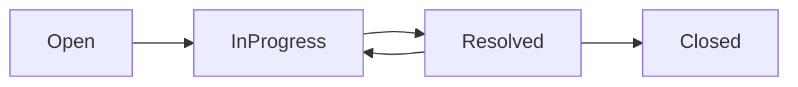
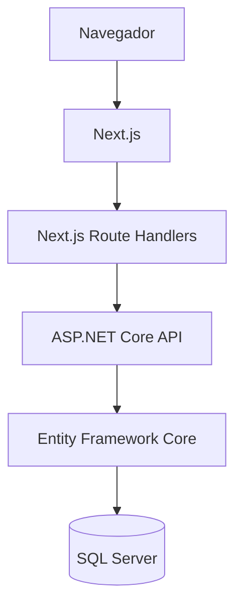
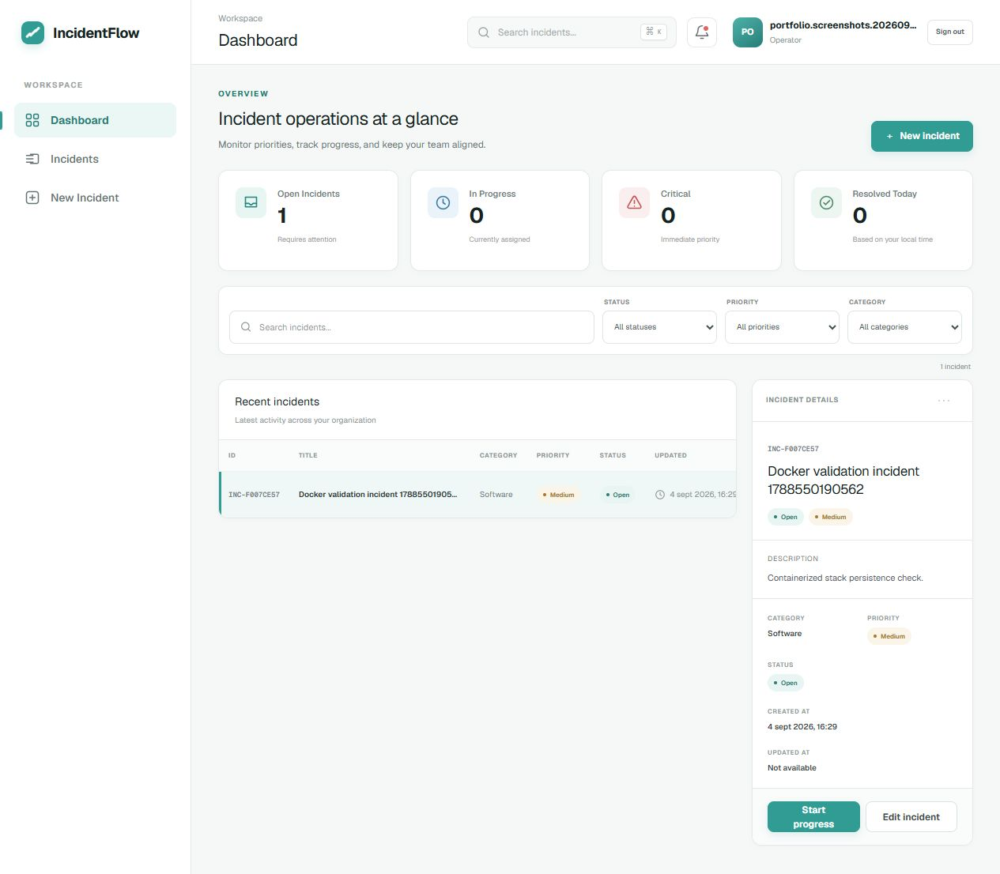
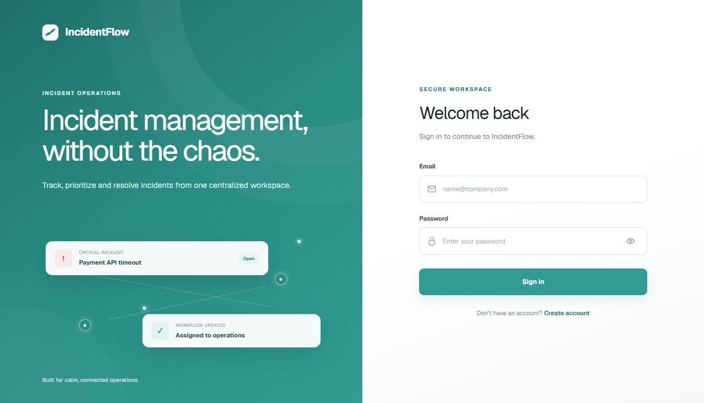
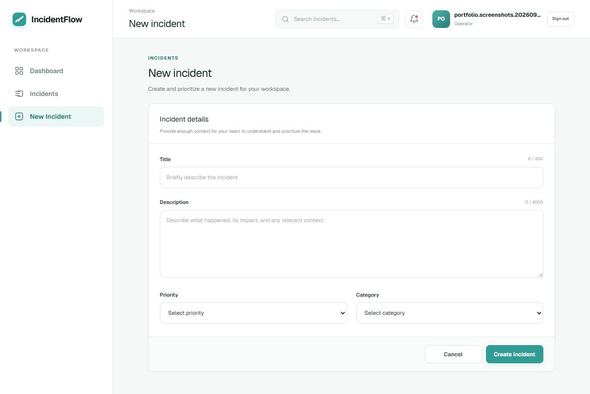

# IncidentFlow

Sistema de gestión de incidencias con enfoque empresarial, desarrollado con .NET 8 y Next.js.

[](https://github.com/FrancoJCabral/IncidentFlow/actions/workflows/ci.yml)

IncidentFlow reemplaza el seguimiento fragmentado de incidencias mediante mensajes, correos electrónicos y herramientas desconectadas por un flujo de trabajo centralizado. Proporciona una visión clara de la prioridad, la categoría, el estado y las métricas operativas de cada incidencia, desde su creación hasta su resolución y cierre.

## Descripción general

IncidentFlow centraliza el registro, la priorización, la categorización, la gestión del ciclo de vida y el archivado de incidencias. La aplicación combina una interfaz web autenticada, métricas en un dashboard, búsqueda y filtros, una API REST y persistencia en SQL Server.

## Funcionalidades principales

- Registro y autenticación de usuarios
- Autenticación JWT mediante cookies HttpOnly
- Autorización basada en roles para usuarios Admin y Operator
- Creación y edición de incidencias
- Gestión de prioridades y categorías
- Flujo controlado de estados
- Archivado mediante soft delete
- KPIs en el dashboard
- Búsqueda y filtros combinados
- Validación y manejo global de errores
- Pruebas automatizadas del dominio y de integración de la API

## Flujo de estados



`Closed` es un estado terminal. Una incidencia en estado `Resolved` puede volver a `InProgress` si el problema reaparece.

## Arquitectura



El frontend almacena el JWT en una cookie HttpOnly. Para las operaciones autenticadas, el navegador llama a los Route Handlers de Next.js, que actúan como límite del lado del servidor y reenvían las solicitudes a la API .NET.

## Stack tecnológico

**Backend**

- .NET 8
- ASP.NET Core Web API
- Entity Framework Core 8
- SQL Server
- Autenticación JWT Bearer
- Swagger / OpenAPI

**Frontend**

- Next.js 16
- React 19
- TypeScript
- Tailwind CSS

**Pruebas**

- xUnit
- `WebApplicationFactory`
- Bases de datos relacionales SQLite en memoria para las pruebas de integración

**Herramientas**

- Visual Studio 2022
- Git / GitHub

## Estructura del proyecto

```text
backend/   API ASP.NET Core, dominio y persistencia
frontend/  Aplicación Next.js y Route Handlers del lado del servidor
tests/     Proyectos de pruebas del dominio y de integración de la API
docs/      Documentación del dominio
```

## Ejecución local

### Visual Studio 2022

Requisitos previos: SDK de .NET 8, Node.js con npm, SQL Server y las herramientas de línea de comandos de EF Core.

1. Clonar el repositorio.
2. Restaurar los paquetes del frontend ejecutando `npm install` desde `frontend/`.
3. Configurar la cadena de conexión de SQL Server y la clave de firma JWT mediante User Secrets:

   ```powershell
   dotnet user-secrets set "ConnectionStrings:IncidentFlowDb" "Server=<SQL_SERVER_INSTANCE>;Database=IncidentFlowDb;Trusted_Connection=True;TrustServerCertificate=True;" --project .\backend\IncidentFlow.Api\IncidentFlow.Api.csproj
   dotnet user-secrets set "Jwt:Key" "<AT_LEAST_32_CHARACTERS_FOR_LOCAL_DEVELOPMENT>" --project .\backend\IncidentFlow.Api\IncidentFlow.Api.csproj
   ```

4. Aplicar las migraciones:

   ```powershell
   dotnet ef database update --project .\backend\IncidentFlow.Api\IncidentFlow.Api.csproj
   ```

5. Copiar `frontend/.env.example` como `frontend/.env.local` y conservar la URL local de la API proporcionada.
6. Abrir `IncidentFlow.sln` y seleccionar `IncidentFlow.Api` como proyecto de inicio.
7. Presionar Play. Visual Studio inicia la API, SpaProxy ejecuta `npm run dev` y el frontend se abre en Chrome.

URLs locales:

- Frontend: [http://localhost:3000](http://localhost:3000)
- API: [https://localhost:7231](https://localhost:7231)
- Swagger: [https://localhost:7231/swagger](https://localhost:7231/swagger)
- Health: [https://localhost:7231/api/health](https://localhost:7231/api/health)

### CLI

Después de completar la misma configuración, ejecutar:

```powershell
dotnet run --project .\backend\IncidentFlow.Api\IncidentFlow.Api.csproj --launch-profile https
```

El perfil de desarrollo de la API utiliza SpaProxy para iniciar Next.js automáticamente.

### Ejecución con Docker

Copiar el archivo de entorno de ejemplo, reemplazar sus marcadores con valores locales de desarrollo e iniciar el stack:

```powershell
Copy-Item .env.example .env
docker compose up --build
```

- Frontend: [http://localhost:3000](http://localhost:3000)
- API: [http://localhost:8080](http://localhost:8080)
- Swagger: [http://localhost:8080/swagger](http://localhost:8080/swagger)
- Health: [http://localhost:8080/api/health](http://localhost:8080/api/health)

Docker Compose inicia SQL Server, aplica las migraciones existentes y luego inicia la API y el frontend. Los datos de SQL Server se almacenan en un volumen con nombre.

## Base de datos

IncidentFlow utiliza SQL Server con las siguientes migraciones:

- `InitialCreate`
- `AddUsers`
- `AddIncidentArchiving`

La eliminación de incidencias está implementada mediante soft delete. Las incidencias archivadas conservan sus datos y se marcan con `IsArchived` y `ArchivedAt` en lugar de eliminarse físicamente.

## Pruebas automatizadas

La solución contiene actualmente 82 pruebas automatizadas: 37 pruebas de dominio y 45 pruebas de integración de la API.

```powershell
dotnet test IncidentFlow.sln
```

## API

| Área | Método | Endpoint | Propósito |
| --- | --- | --- | --- |
| Autenticación | `POST` | `/api/auth/register` | Registrar una cuenta Operator |
| Autenticación | `POST` | `/api/auth/login` | Autenticar un usuario |
| Autenticación | `GET` | `/api/auth/me` | Obtener el usuario autenticado |
| Incidencias | `GET` | `/api/incidents` | Listar las incidencias activas |
| Incidencias | `GET` | `/api/incidents/{id}` | Obtener una incidencia |
| Incidencias | `POST` | `/api/incidents` | Crear una incidencia |
| Incidencias | `PUT` | `/api/incidents/{id}` | Editar una incidencia |
| Incidencias | `PATCH` | `/api/incidents/{id}/status` | Cambiar el estado de una incidencia |
| Incidencias | `DELETE` | `/api/incidents/{id}` | Archivar una incidencia |
| Estado | `GET` | `/api/health` | Comprobar el estado de la API |

`DELETE` realiza un soft delete o archivado y no elimina físicamente la incidencia.

## Decisiones técnicas

- Las transiciones de estado se controlan mediante reglas de dominio en lugar de actualizaciones arbitrarias.
- El soft delete preserva el historial de las incidencias.
- El frontend mantiene los JWT en cookies HttpOnly en lugar de almacenarlos en el navegador.
- Los Route Handlers de Next.js proporcionan un límite del lado del servidor entre el navegador y la API .NET.
- Las pruebas de integración de la API utilizan una base de datos relacional SQLite en memoria.
- SQL Server se utiliza para la persistencia local de la aplicación.

Puede consultarse más información sobre el dominio en [`docs/domain.md`](docs/domain.md).

## Capturas de pantalla

### Dashboard



### Inicio de sesión



### Nueva incidencia



## Estado del proyecto

**Completado:** MVP, autenticación, ciclo de vida de incidencias, dashboard, búsqueda y filtros, archivado, pruebas automatizadas, Docker y GitHub Actions.

IncidentFlow está terminado dentro de su alcance como proyecto de portfolio.

## Autor

Franco J. Cabral — [GitHub](https://github.com/FrancoJCabral)
